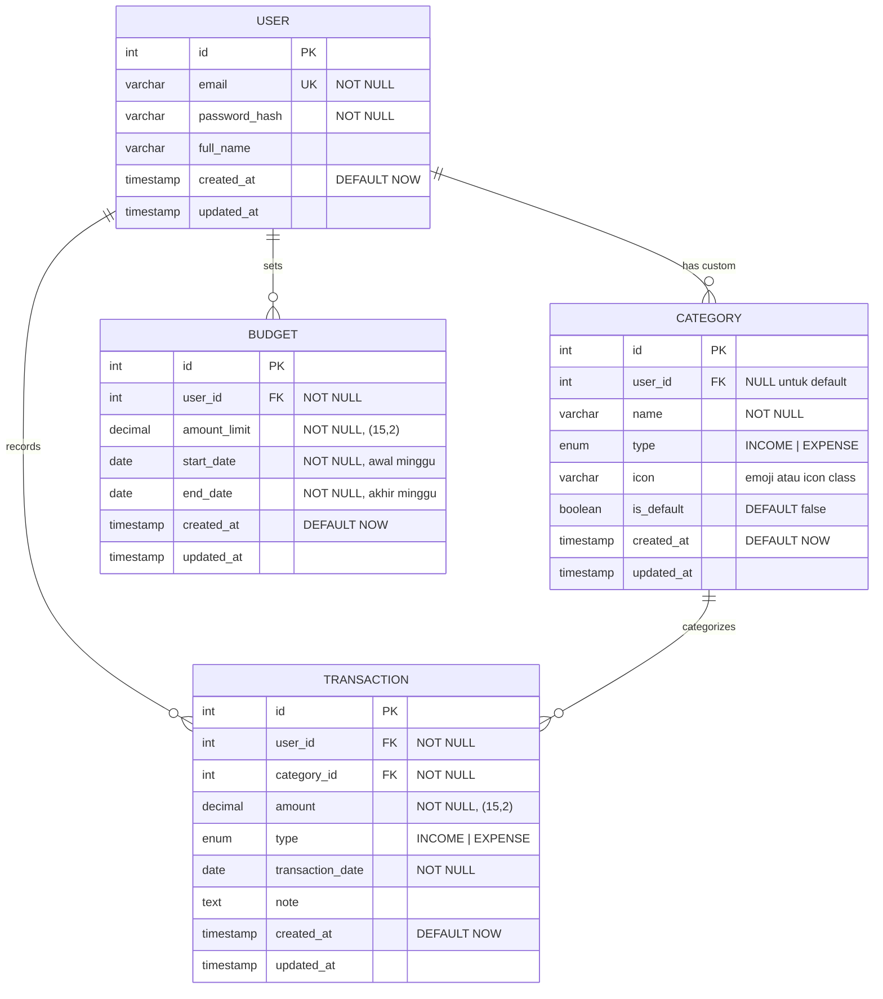

# ERD: WeeklyCash

> Berdasarkan: [prd.md](./prd.md)

## Diagram

## Deskripsi Entitas

### User

| Field | Type | Constraint | Keterangan |
|-------|------|------------|------------|
| id | Integer | PK, AUTO INCREMENT | Primary key |
| email | Varchar | UNIQUE, NOT NULL | Email untuk login |
| password_hash | Varchar | NOT NULL | Hash password (bcrypt/argon2) |
| full_name | Varchar | — | Nama tampilan user |
| created_at | Timestamp | DEFAULT NOW | Waktu registrasi |
| updated_at | Timestamp | — | Waktu terakhir diupdate |

### Category

| Field | Type | Constraint | Keterangan |
|-------|------|------------|------------|
| id | Integer | PK, AUTO INCREMENT | Primary key |
| user_id | Integer | FK → User, NULLABLE | NULL = kategori default bawaan sistem |
| name | Varchar | NOT NULL | Nama kategori (e.g., "Makanan") |
| type | Enum | NOT NULL | `INCOME` atau `EXPENSE` |
| icon | Varchar | — | Emoji atau icon class name (e.g., "🍔") |
| is_default | Boolean | DEFAULT false | true = kategori bawaan, tidak bisa dihapus user |
| created_at | Timestamp | DEFAULT NOW | Waktu dibuat |
| updated_at | Timestamp | — | Waktu terakhir diupdate |

### Transaction

| Field | Type | Constraint | Keterangan |
|-------|------|------------|------------|
| id | Integer | PK, AUTO INCREMENT | Primary key |
| user_id | Integer | FK → User, NOT NULL | Pemilik transaksi |
| category_id | Integer | FK → Category, NOT NULL | Kategori transaksi |
| amount | Decimal(15,2) | NOT NULL | Nominal transaksi (menghindari floating point) |
| type | Enum | NOT NULL | `INCOME` atau `EXPENSE` |
| transaction_date | Date | NOT NULL | Tanggal transaksi (bisa backdate) |
| note | Text | — | Catatan opsional |
| created_at | Timestamp | DEFAULT NOW | Waktu pencatatan |
| updated_at | Timestamp | — | Waktu terakhir diupdate |

### Budget

| Field | Type | Constraint | Keterangan |
|-------|------|------------|------------|
| id | Integer | PK, AUTO INCREMENT | Primary key |
| user_id | Integer | FK → User, NOT NULL | Pemilik budget |
| amount_limit | Decimal(15,2) | NOT NULL | Batas maksimal pengeluaran minggu ini |
| start_date | Date | NOT NULL | Tanggal awal minggu (Senin) |
| end_date | Date | NOT NULL | Tanggal akhir minggu (Minggu) |
| created_at | Timestamp | DEFAULT NOW | Waktu dibuat |
| updated_at | Timestamp | — | Waktu terakhir diupdate |

## Penjelasan Relasi

| Relasi | Tipe | Keterangan |
|--------|------|------------|
| User → Category | One-to-Many | User bisa membuat kategori kustom. Kategori default (`user_id = NULL`) tersedia untuk semua user. |
| User → Transaction | One-to-Many | Setiap transaksi dimiliki oleh satu user. |
| User → Budget | One-to-Many | User bisa memiliki beberapa budget (satu per minggu). |
| Category → Transaction | One-to-Many | Setiap transaksi harus memiliki satu kategori. |

## Catatan Teknis

- **Tipe `decimal(15,2)`** digunakan untuk field uang agar menghindari *floating point issue*.
- **`transaction_date`** dipisahkan dari `created_at` agar user bisa *backdate* pencatatan (e.g., mencatat pengeluaran kemarin).
- **Budget menggunakan `start_date` + `end_date`**: Saat user buka dashboard, query budget aktif dengan `WHERE start_date <= TODAY AND end_date >= TODAY`.
- **Sisa budget** dihitung secara derived: `amount_limit - SUM(transactions.amount WHERE type = 'EXPENSE' AND transaction_date BETWEEN start_date AND end_date)`.
- **`type` menggunakan Enum** (`INCOME`/`EXPENSE`) bukan varchar biasa untuk data integrity dan menghindari inkonsistensi.

## Traceability ke PRD

| PRD Feature | Entitas Terkait |
|-------------|----------------|
| Transaction Logging | `Transaction`, `Category` |
| Weekly Budget Setting | `Budget` |
| Dashboard Visual | `Budget` + `Transaction` (derived) |
| Category Management | `Category` |
| History Ledger | `Transaction` |
| Authentication | `User` |