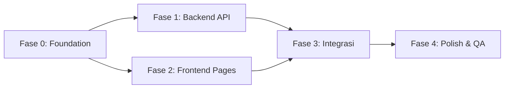

# Implementation Plan: WeeklyCash

> Berdasarkan: [prd.md](./prd.md) | [erd.md](./erd.md) | [api-contract.md](./api-contract.md) | [ux-flow.md](./ux-flow.md) | [ui-spec.md](./ui-spec.md)

## Overview

Implementasi dibagi menjadi **5 fase** yang dikerjakan secara berurutan. Setiap fase memiliki dependency ke fase sebelumnya. Target: **MVP Core Features** sesuai PRD.

```
Fase 0 (Foundation)  →  Fase 1 (Backend API)  →  Fase 2 (Frontend Pages)
                                                        ↓
                                          Fase 3 (Integrasi FE ↔ BE)
                                                        ↓
                                              Fase 4 (Polish & QA)
```

### Tech Stack Reference

| Layer | Tech |
|-------|------|
| Backend | Hono + `@hono/node-server` + `@hono/zod-validator` |
| Database | PostgreSQL 16 (Docker) + Prisma 7 |
| Frontend | TanStack Start (React 19) + TanStack Router + Query |
| Styling | Tailwind CSS v4 + shadcn/ui (new-york) |
| Validation | Zod |
| API Client | Hono RPC (`hc<AppType>`) |

---

## Fase 0: Foundation & Setup

> **Goal**: Prisma schema siap, database termigrasi, seed data tersedia, dan auth middleware berfungsi.

### 0.1 Prisma Schema

- [ ] Definisikan model `User` di `prisma/schema.prisma`
  - Fields: `id`, `email`, `passwordHash`, `fullName`, `createdAt`, `updatedAt`
  - Constraint: `email` unique
- [ ] Definisikan enum `TransactionType` (`INCOME`, `EXPENSE`)
- [ ] Definisikan model `Category`
  - Fields: `id`, `userId` (optional FK), `name`, `type` (enum), `icon`, `isDefault`, `createdAt`, `updatedAt`
  - Relasi: `User? → Category[]`
- [ ] Definisikan model `Transaction`
  - Fields: `id`, `userId` (FK), `categoryId` (FK), `amount` (Decimal), `type` (enum), `transactionDate`, `note`, `createdAt`, `updatedAt`
  - Relasi: `User → Transaction[]`, `Category → Transaction[]`
- [ ] Definisikan model `Budget`
  - Fields: `id`, `userId` (FK), `amountLimit` (Decimal), `startDate`, `endDate`, `createdAt`, `updatedAt`
  - Relasi: `User → Budget[]`
  - Constraint: unique composite `[userId, startDate]` (1 budget per minggu per user)
- [ ] Jalankan `pnpm db:migrate` — buat migration pertama
- [ ] Jalankan `pnpm db:generate` — generate Prisma Client

### 0.2 Seed Data

- [ ] Buat file `prisma/seed.ts`
- [ ] Seed kategori default (is_default = true, user_id = null):
  - Expense: Makanan 🍔, Transportasi 🚗, Hiburan 🎮, Tagihan 🏠, Belanja 🛒, Lainnya 📦
  - Income: Gaji 💰, Freelance 💼, Bonus 🎁
- [ ] Seed 1 user dummy (untuk development)
- [ ] Seed beberapa transaksi dummy (mix income/expense, berbagai tanggal)
- [ ] Seed 1 budget minggu ini
- [ ] Tambahkan script `"db:seed"` di `apps/api/package.json`
- [ ] Test: jalankan seed, verifikasi via `pnpm db:studio`

### 0.3 Auth Utility

- [ ] Install dependency: `bcryptjs` (hash password), `hono/jwt` atau `jsonwebtoken` (JWT)
- [ ] Buat `src/utils/auth.ts`:
  - `hashPassword(plain: string): Promise<string>`
  - `verifyPassword(plain: string, hash: string): Promise<boolean>`
  - `generateToken(userId: number): string`
  - `verifyToken(token: string): { userId: number }`
- [ ] Buat middleware `src/middleware/auth.ts`:
  - Extract Bearer token dari header `Authorization`
  - Verify JWT → inject `userId` ke Hono context (`c.set("userId", ...)`)
  - Return 401 jika token invalid/missing

### 0.4 Backend Structure (Feature-based)

- [ ] Buat struktur folder backend:
  ```
  apps/api/src/
  ├── index.ts                # Entry point, mount routes
  ├── core/                   # Global configuration & utilities
  │   ├── middleware/
  │   │   └── auth.middleware.ts
  │   └── utils/
  │       └── prisma.ts       # Prisma client instance
  └── modules/                # Feature modules
      ├── auth/
      │   ├── auth.routes.ts
      │   └── auth.utils.ts
      ├── categories/
      │   └── categories.routes.ts
      ├── transactions/
      │   └── transactions.routes.ts
      ├── budgets/
      │   └── budgets.routes.ts
      └── dashboard/
          └── dashboard.routes.ts
  ```
- [ ] Setup `index.ts`: mount semua route files ke app dengan prefix `/api/v1`
- [ ] Export `AppType` dari `index.ts` untuk Hono RPC

**✅ Fase 0 selesai ketika**: `pnpm db:studio` menampilkan semua tabel dengan seed data, dan backend bisa start tanpa error.

---

## Fase 1: Backend API

> **Goal**: Semua endpoint di API Contract berfungsi dan bisa ditest via curl/Postman.

### 1.1 Auth Endpoints

- [x] `POST /api/v1/auth/register`
  - Zod validation: email (valid format), password (min 8 char), full_name (optional)
  - Hash password → simpan ke DB
  - Return 201 + user data (tanpa password)
  - Return 409 jika email sudah ada
- [x] `POST /api/v1/auth/login`
  - Zod validation: email, password
  - Cari user by email → verify password
  - Generate JWT token
  - Return 200 + token + user data
  - Return 401 jika invalid
- [x] `GET /api/v1/auth/me` (protected)
  - Return profil user yang login
- [x] `PUT /api/v1/auth/me` (protected)
  - Update full_name
  - Return updated user data
- [x] **Test**: register → login → access protected route

### 1.2 Category Endpoints

- [x] `GET /api/v1/categories` (protected)
  - Return kategori default (user_id = null) + kategori kustom milik user
  - Optional filter by `type` (INCOME/EXPENSE)
- [x] `POST /api/v1/categories` (protected)
  - Zod validation: name (required), type (enum), icon (optional)
  - Set user_id = current user, is_default = false
  - Return 201
- [x] `PUT /api/v1/categories/:id` (protected)
  - Cek ownership (user_id = current user) dan bukan default
  - Return 403 jika kategori default
  - Return 404 jika bukan milik user
- [x] `DELETE /api/v1/categories/:id` (protected)
  - Cek ownership dan bukan default
  - Cek apakah masih ada transaksi yang pakai kategori ini
  - Return 409 jika masih ada transaksi terkait
  - Return 403 jika default

### 1.3 Transaction Endpoints

- [x] `GET /api/v1/transactions` (protected)
  - Filter: `type`, `category_id`, `start_date`, `end_date`
  - Pagination: `page`, `limit` (default 10, max 100)
  - Sorting: `sort` (default `transaction_date`), `order` (default `desc`)
  - Include category relation (id, name, icon)
  - Return `{ data: [...], meta: { page, limit, total } }`
- [x] `POST /api/v1/transactions` (protected)
  - Zod validation: amount (positive), type (enum), category_id (valid, milik user atau default), transaction_date (not future), note (optional)
  - Validasi: category type harus match transaction type
  - Return 201
- [x] `GET /api/v1/transactions/:id` (protected)
  - Cek ownership
  - Include category relation
  - Return 404 jika tidak ada/bukan milik user
- [x] `PUT /api/v1/transactions/:id` (protected)
  - Cek ownership
  - Partial update (semua field opsional kecuali id)
- [x] `DELETE /api/v1/transactions/:id` (protected)
  - Cek ownership
  - Hard delete
  - Return 200

### 1.4 Budget Endpoints

- [x] `GET /api/v1/budgets/current` (protected)
  - Cari budget dimana `start_date <= today <= end_date`
  - Hitung `spent`: SUM transaksi EXPENSE di rentang tanggal tersebut
  - Hitung `remaining`: `amount_limit - spent`
  - Hitung `percentage`: `(spent / amount_limit) * 100`
  - Hitung `transaction_count`
  - Return 404 jika belum set budget minggu ini
- [x] `GET /api/v1/budgets` (protected)
  - List semua budget milik user, ordered by start_date desc
  - Pagination
  - Include computed fields: spent, remaining, percentage
- [x] `POST /api/v1/budgets` (protected)
  - Zod validation: amount_limit (positive), start_date (harus Senin), end_date (harus Minggu, = start_date + 6 hari)
  - Cek unique: belum ada budget di minggu yang sama
  - Return 409 jika sudah ada
- [x] `PUT /api/v1/budgets/:id` (protected)
  - Cek ownership
  - Update amount_limit saja

### 1.5 Dashboard Endpoint

- [x] `GET /api/v1/dashboard/summary` (protected)
  - `current_budget`: sama dengan GET /budgets/current (atau null)
  - `weekly_summary`: total income, total expense, transaction count (minggu ini)
  - `category_breakdown`: group by category, hitung total + percentage (minggu ini, expense only)
  - `recent_transactions`: 5 transaksi terakhir

**✅ Fase 1 selesai ketika**: Semua endpoint bisa ditest via curl/Postman dan mengembalikan response sesuai API Contract.

---

## Fase 2: Frontend Pages

> **Goal**: Semua halaman ter-render dengan data mock/dummy, layout sesuai UI Spec.

### 2.1 Frontend Structure (Feature-based)

- [x] Setup struktur folder frontend berbasis fitur untuk skalabilitas:
  ```
  apps/web/src/
  ├── core/               # Konfigurasi global & utilitas utama
  │   ├── api/            # Hono RPC client & react-query configs
  │   ├── auth/           # Jotai atoms untuk state auth & utility penyimpan token
  │   └── layout/         # Layout utama (AppLayout, Sidebar, dsb)
  ├── components/         # Shared UI components (kebanyakan dari shadcn/ui)
  │   └── ui/             # Button, Input, Table, Card, dsb.
  ├── features/           # Modul fitur bisnis aplikasi
  │   ├── auth/           # Komponen spesifik Auth (LoginForm, RegisterForm)
  │   ├── categories/     # Komponen Categories (CategoryList, CategoryForm)
  │   ├── transactions/   # Komponen Transaksi (TransactionTable, FilterBar)
  │   ├── budgets/        # Komponen Budget (BudgetProgressBar, ModalEdit)
  │   └── dashboard/      # SummaryCards, DashboardCharts
  ├── routes/             # TanStack Router file-based routing
  │   ├── _auth.tsx       # Layout guard (redirect param)
  │   ├── index.tsx       # Root/Redirect ke dashboard
  │   ├── dashboard.tsx
  │   ├── transactions/
  │   ├── budgets/
  │   └── categories/
  └── styles.css          # Token UI & Tailwind imports
  ```
- [x] Refactor struktur basic TanStack Start yang ter-generate menjadi feature-based sesuai pohon di atas.

### 2.2 Setup & Layout

- [x] Install shadcn/ui components yang dibutuhkan:
  ```text
  button card input select table badge progress pagination
  alert dialog alert-dialog sheet separator dropdown-menu
  popover calendar textarea toggle-group toast label
  ```
- [x] Install `jotai` untuk state management
- [x] Install `recharts` untuk chart dashboard
- [x] Setup Google Font **Inter** di `styles.css`
- [x] Pastikan folder `src/components/layout/` (sekarang dipindah ke `src/core/layout/`) sudah ada:
  - `AppLayout.tsx` — sidebar + content area wrapper
  - `Sidebar.tsx` — navigasi utama (5 menu items)
  - `BottomNav.tsx` — mobile bottom navigation
  - `PageHeader.tsx` — judul halaman + action button
- [x] Setup auth guard route di `routes/_auth.tsx` — redirect ke `/login` jika belum login
- [x] Definisikan design tokens di `styles.css` (custom CSS variables untuk income/expense/budget colors)

### 2.3 Auth Pages

- [x] `src/routes/auth/login.tsx`
  - Card centered, form email + password
  - Link ke register
- [x] `src/routes/auth/register.tsx`
  - Card centered, form nama + email + password
  - Link ke login
- [x] Buat utilitas Auth di `src/core/auth/auth_utils.ts` — simpan/hapus/baca JWT token dari localStorage

### 2.4 Dashboard Page

- [x] `src/routes/dashboard.tsx` (diimplementasikan di `_auth.index.tsx` sebagai home)
  - Budget card + progress bar (warna dinamis berdasarkan persentase)
  - No-budget banner (jika belum set budget)
  - Summary cards: income, expense, transaction count
  - Category breakdown (donut chart atau bar list)
  - Recent transactions list (5 item)
  - Link "Lihat Semua" ke /transactions

### 2.5 Transaction Pages

- [x] `src/routes/transactions/index.tsx`
  - Filter bar: waktu, tipe, kategori, search
  - Summary bar: total income + total expense (terfilter)
  - Table (desktop) / Card list (mobile)
  - Pagination
  - Edit via Sheet (slide-in dari kanan)
  - Delete via AlertDialog
- [x] `src/routes/transactions/new.tsx`
  - Form: type toggle, nominal, category select, date picker, note textarea
  - Auto-format nominal (ribuan)
  - Category dropdown filtered by type

### 2.6 Budget Pages

- [x] `src/routes/budgets/index.tsx`
  - Stack of budget cards (per minggu)
  - Current week (active state) vs Past weeks
  - Badges ("Aktif", "On Track", "Over Budget")
  - Progress bar dinamis (safe/warning/danger)
  - Klik card -> Sheet form edit
- [x] `src/routes/budgets/new.tsx`
  - Nominal input
  - DateRange picker (auto-filled senin-minggu)

### 2.7 Category Page

- [x] `src/routes/categories/index.tsx`
  - Dua section list: Pengeluaran dan Pemasukan
  - Indikator badge default vs kustom
  - Button Edit (kustom only) -> membuka Dialog form
  - Button Delete (kustom only) -> AlertDialog konfirmasi
  - Button "Baru" (header) -> membuka Dialog form (nama, tipe, emoji/ikon)
  - Delete via AlertDialog

### 2.8 Settings Page

- [x] `src/routes/settings.tsx`
  - Profil form (Nama editable, Email disabled + lock icon)
  - Button Simpan
  - Separator
  - Button Logout (Destructive) -> clear Token -> Redirect Login

**✅ Fase 2 selesai ketika**: Semua halaman ter-render, navigasi berfungsi, form bisa diisi (tapi belum connect ke API).

---

## Fase 3: Integrasi Frontend ↔ Backend

> **Goal**: Frontend terhubung ke Backend via Hono RPC. Semua data real dari database.

### 3.1 API Client Setup

- [x] Setup Hono RPC client di `src/utils/api.ts`:
  ```typescript
  import type { AppType } from "api/src/index";
  import { hc } from "hono/client";
  const api = hc<AppType>(import.meta.env.VITE_API_BASE_URL);
  export { api };
  ```
- [x] Setup TanStack Query client dengan default options (staleTime, retry, dll)
- [x] Buat interceptor/wrapper untuk attach JWT token ke setiap request

### 3.2 Auth Integration

- [x] Connect login form → `POST /auth/login` → simpan token → redirect
- [x] Connect register form → `POST /auth/register` → redirect ke login
- [x] Implement auth guard: cek token validity saat route load
- [x] Connect settings → `GET /auth/me` + `PUT /auth/me`
- [x] Implement logout: clear token → redirect ke login

### 3.3 Dashboard Integration

- [x] Query: `GET /dashboard/summary` via TanStack Query
- [x] Map data ke progress bar, summary cards, chart, recent transactions
- [x] Handle state: loading (skeleton), no-budget (banner), error (retry)

### 3.4 Transaction Integration

- [x] Query: `GET /transactions` — list dengan filter & pagination
- [x] Mutation: `POST /transactions` — create → invalidate queries → redirect
- [x] Mutation: `PUT /transactions/:id` — edit via Sheet → invalidate
- [x] Mutation: `DELETE /transactions/:id` — delete → invalidate
- [x] Optimistic update untuk delete (hapus dari list sebelum server confirm)

### 3.5 Budget Integration

- [x] Query: `GET /budgets` — list riwayat
- [x] Query: `GET /budgets/current` — budget aktif
- [x] Mutation: `POST /budgets` — create budget baru
- [x] Mutation: `PUT /budgets/:id` — update limit
- [x] Handle 409 conflict (budget minggu ini sudah ada)

### 3.6 Category Integration

- [x] Query: `GET /categories` — list semua
- [x] Mutation: `POST /categories` — tambah kustom
- [x] Mutation: `PUT /categories/:id` — edit kustom
- [x] Mutation: `DELETE /categories/:id` — hapus (handle 409 jika masih dipakai)

**✅ Fase 3 selesai ketika**: Semua fitur berfungsi end-to-end dengan data dari database. [COMPLETED]

---

## Fase 4: Polish & QA

> **Goal**: Aplikasi terasa premium, responsive, dan siap digunakan.

### 4.1 Responsive & Mobile

- [ ] Test semua halaman di mobile viewport (375px, 390px, 414px)
- [ ] Pastikan bottom navigation ter-render hanya di mobile
- [ ] Pastikan FAB (+) muncul dan berfungsi di mobile
- [ ] Test transaction list: table → card list di mobile
- [ ] Test sidebar collapse di tablet (768px – 1023px)

### 4.2 Animasi & Micro-interactions

- [x] Progress bar: smooth transition saat value berubah
- [x] Dashboard numbers: count-up animation saat loaded
- [x] Budget warning: pulse animation saat ≥ 80%
- [x] Toast notifications: slide-in, auto-dismiss 3 detik
- [x] Card hover: subtle shadow transition
- [ ] FAB: scale on hover/active
- [x] Sheet/Dialog: smooth slide/fade transitions

### 4.3 Edge Cases & Error Handling

- [x] Empty states: semua halaman punya tampilan kosong yang baik
- [x] Loading states: skeleton placeholders di semua halaman
- [x] Error states: alert + retry button
- [x] Network error: toast notification
- [x] Token expired: auto-redirect ke login
- [x] Form validation: inline errors per field (client-side + server-side handled via toast/alert)
- [x] Nominal formatting: auto-format ribuan, handle edge cases (0, negatif)
- [x] Date validation: tidak boleh transaksi di masa depan

### 4.4 Performance

- [x] Implement debounce 300ms pada search input
- [x] Lazy load halaman yang tidak langsung diakses
- [x] Optimistic update pada delete transaction
- [x] Proper cache invalidation strategy dengan TanStack Query

### 4.5 Final Checks

- [x] Semua halaman punya `<title>` tag yang sesuai
- [x] Semua interactive elements punya unique ID
- [x] `pnpm lint` pass tanpa error
- [x] `pnpm build` berhasil tanpa error
- [ ] Test full user flow: register → login → set budget → catat transaksi → lihat dashboard → edit → hapus → logout

**✅ Fase 4 selesai ketika**: Aplikasi bisa dipakai end-to-end, responsive, dan terasa polished.

---

## Dependency Graph



> **Note**: Fase 1 (Backend) dan Fase 2 (Frontend) bisa dikerjakan **paralel** setelah Fase 0 selesai.

## Estimasi Waktu

| Fase | Estimasi | Keterangan |
|------|----------|------------|
| Fase 0: Foundation | 1 hari | Schema, seed, auth utility, folder structure |
| Fase 1: Backend API | 2–3 hari | 19 endpoints, validasi, business logic |
| Fase 2: Frontend Pages | 3–4 hari | 9 halaman, komponen, layout |
| Fase 3: Integrasi | 2–3 hari | Connect semua FE ↔ BE |
| Fase 4: Polish & QA | 1–2 hari | Responsive, animasi, edge cases |
| **Total** | **~9–13 hari** | Solo developer, full-time |
