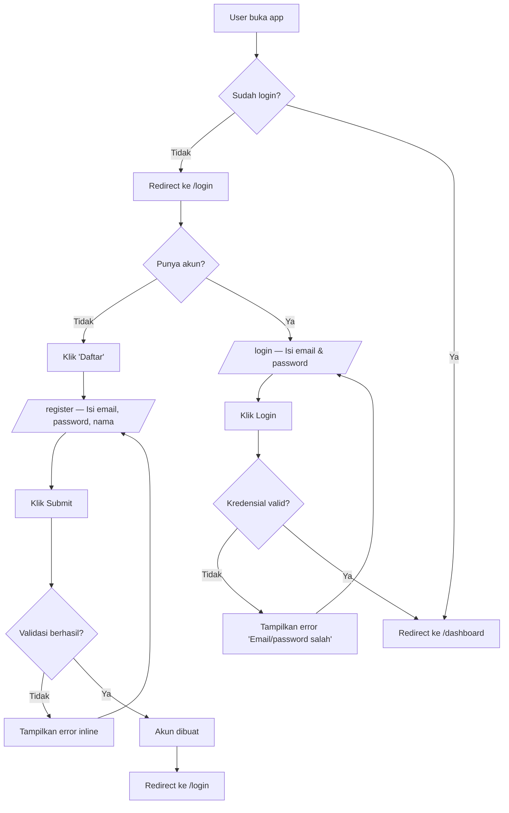
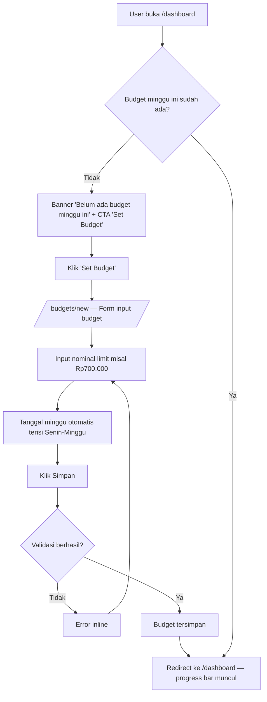
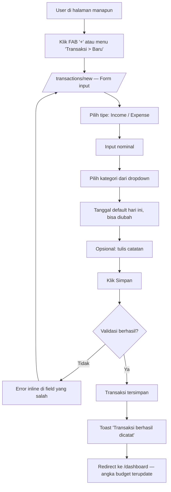
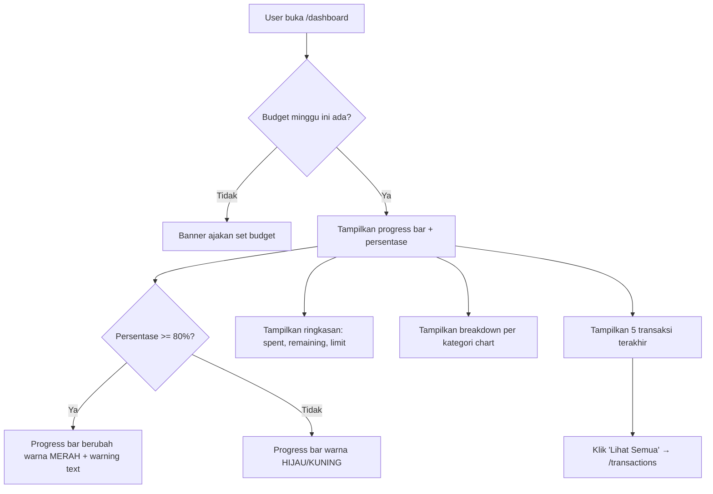
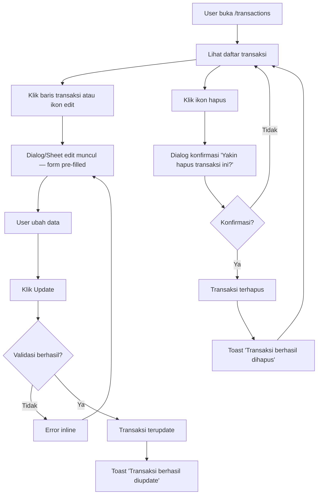
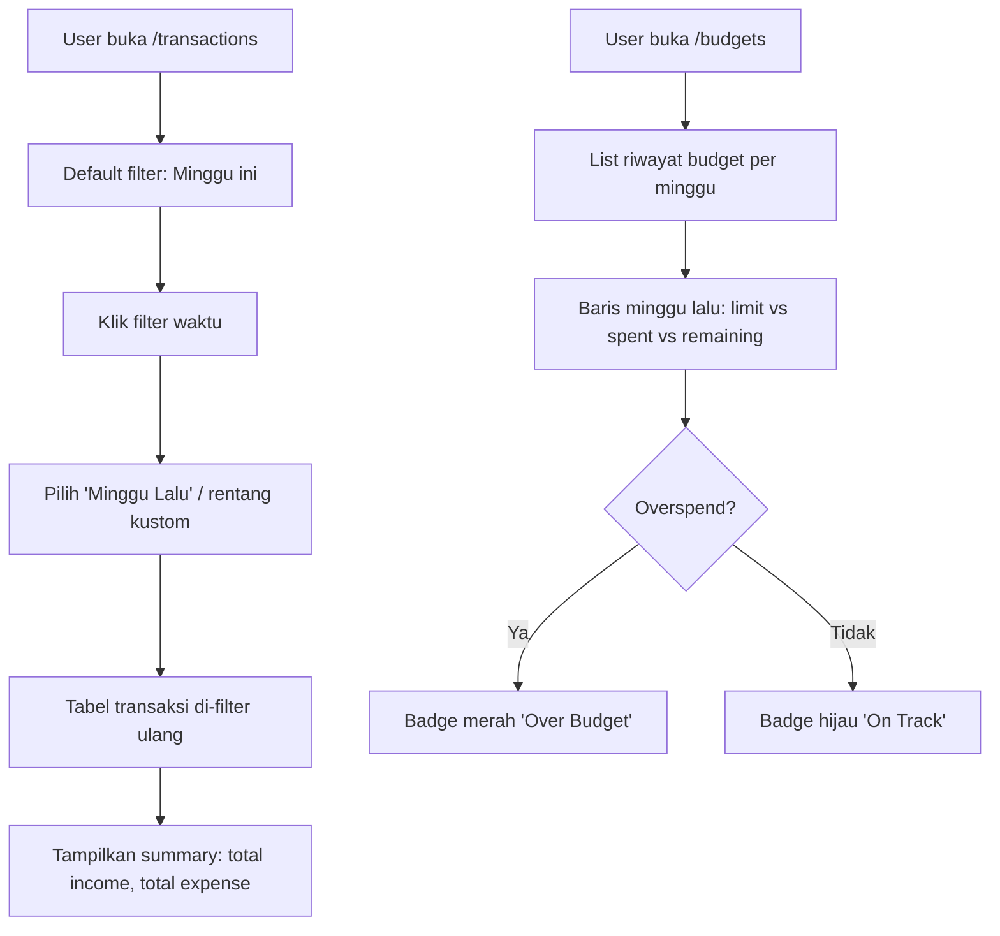

# UX Flow: WeeklyCash

> Berdasarkan: [prd.md](./prd.md)

## Sitemap

```
/                               → Redirect ke /dashboard (jika login) atau /login
├── /auth
│   ├── /login                  → Halaman login
│   └── /register               → Halaman registrasi
├── /dashboard                  → Dashboard utama (budget overview + ringkasan)
├── /transactions
│   ├── /                       → Daftar riwayat transaksi (History Ledger)
│   └── /new                    → Form input transaksi baru
├── /budgets
│   ├── /                       → Riwayat budget mingguan
│   └── /new                    → Set budget minggu baru
├── /categories
│   └── /                       → Kelola kategori (list + CRUD)
└── /settings
    └── /                       → Pengaturan profil akun
```

## Navigation Pattern

- **Layout utama**: Sidebar (desktop) + Bottom navigation (mobile)
- **Sidebar items**:
  - 📊 Dashboard
  - 💸 Transaksi
  - 🎯 Budget
  - 🏷️ Kategori
  - ⚙️ Settings
- **Navigasi sekunder**: Breadcrumb di halaman detail
- **Auth guard**: Semua halaman kecuali `/auth/*` membutuhkan login. Redirect ke `/login` jika belum login.
- **Quick action**: Floating Action Button (FAB) "+" di mobile untuk tambah transaksi cepat

## User Flows

### Flow 1: Registrasi & Login



### Flow 2: Set Budget Mingguan

> **User Story**: *"Sebagai user, saya ingin menentukan budget mingguan sebesar Rp700.000, agar saya punya batasan harian yang jelas dan tidak boros."*



### Flow 3: Catat Transaksi Cepat

> **User Story**: *"Sebagai user, saya ingin mencatat pengeluaran makan siang dengan cepat, agar saya tidak lupa mencatat detail kecil saat sedang bepergian."*



### Flow 4: Lihat Dashboard & Progress Budget

> **User Story**: *"Sebagai user, saya ingin melihat persentase budget yang sudah terpakai di dashboard, agar saya bisa mengerem pengeluaran jika kuota sudah mencapai 80%."*



### Flow 5: Edit / Hapus Transaksi

> **User Story**: *"Sebagai user, saya ingin mengedit atau menghapus transaksi yang salah input, agar data keuangan saya tetap akurat."*



### Flow 6: Lihat Rekap Minggu Lalu

> **User Story**: *"Sebagai user, saya ingin melihat rekap pengeluaran minggu lalu, agar saya bisa mengevaluasi apakah budget minggu ini perlu ditambah atau dikurangi."*



## State per Halaman

### /login

| State | Tampilan |
|-------|----------|
| Default | Form email + password + tombol Login + link Daftar |
| Loading | Tombol Login disabled + spinner |
| Error | Inline error di bawah form ("Email atau password salah") |
| Success | Redirect ke /dashboard |

### /register

| State | Tampilan |
|-------|----------|
| Default | Form email + password + nama + tombol Daftar + link Login |
| Loading | Tombol Daftar disabled + spinner |
| Error | Inline error per field (email sudah terdaftar, password terlalu pendek) |
| Success | Redirect ke /login dengan toast "Registrasi berhasil" |

### /dashboard

| State | Tampilan |
|-------|----------|
| Loading | Skeleton placeholder untuk semua widget |
| No Budget | Banner "Belum ada budget minggu ini" + CTA "Set Budget" |
| Normal (< 80%) | Progress bar hijau/kuning + ringkasan + chart kategori + recent transactions |
| Warning (≥ 80%) | Progress bar merah + warning text "Budget hampir habis!" |
| Over Budget | Progress bar merah penuh + badge "Over Budget" |

### /transactions

| State | Tampilan |
|-------|----------|
| Loading | Skeleton placeholder |
| Empty | Ilustrasi + "Belum ada transaksi" + CTA "Catat Transaksi Pertama" |
| Success | Tabel transaksi + filter (waktu, tipe, kategori) + pagination |
| Error | Alert banner + tombol retry |

### /transactions/new

| State | Tampilan |
|-------|----------|
| Default | Form kosong (tipe, nominal, kategori, tanggal, catatan) |
| Loading | Tombol Simpan disabled + spinner |
| Error | Inline error di field yang salah |
| Success | Toast "Transaksi berhasil dicatat" + redirect ke /dashboard |

### /budgets

| State | Tampilan |
|-------|----------|
| Loading | Skeleton placeholder |
| Empty | "Belum pernah set budget" + CTA |
| Success | List card budget per minggu (limit, spent, remaining, status badge) |

### /budgets/new

| State | Tampilan |
|-------|----------|
| Default | Form: nominal limit, tanggal minggu (auto-filled) |
| Conflict | Error "Budget minggu ini sudah ada" + link ke edit |
| Loading | Tombol disabled + spinner |
| Success | Toast + redirect ke /dashboard |

### /categories

| State | Tampilan |
|-------|----------|
| Loading | Skeleton placeholder |
| Success | List kategori (default + kustom) — kustom bisa edit/hapus |
| Empty Custom | Hanya kategori default + CTA "Tambah Kategori" |

### /settings

| State | Tampilan |
|-------|----------|
| Default | Form profil (nama, email) + tombol Simpan |
| Loading | Spinner |
| Success | Toast "Profil berhasil diupdate" |
